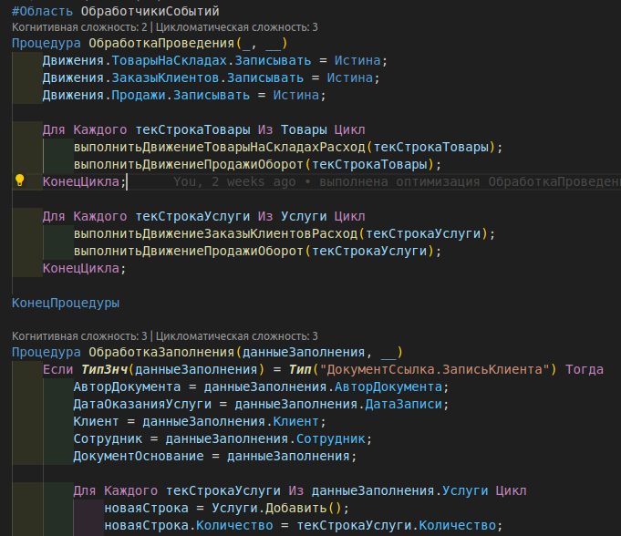
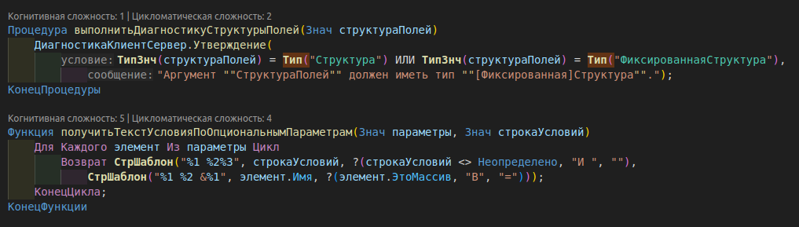
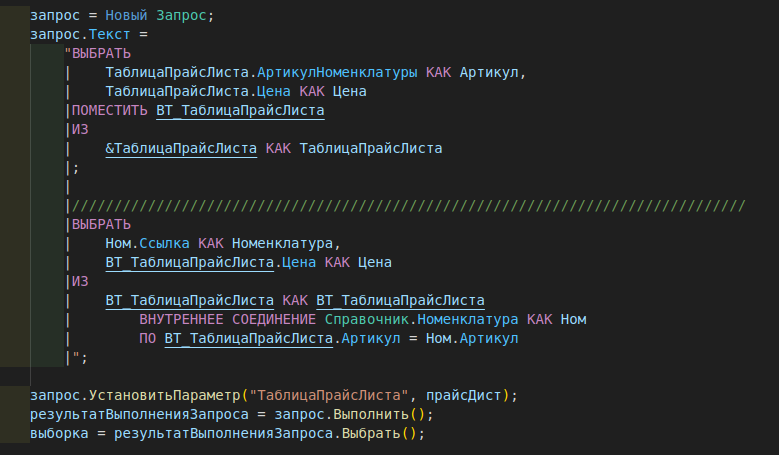

# Подсветка синтаксиса языка 1С:Предприятие (BSL) для vscode

|Пример подсветки|
|---|
||
||
||

---

> Расширение реализовано на базе репозитория: [ [1c-syntax/1c-syntax](https://github.com/1c-syntax/1c-syntax) ]
